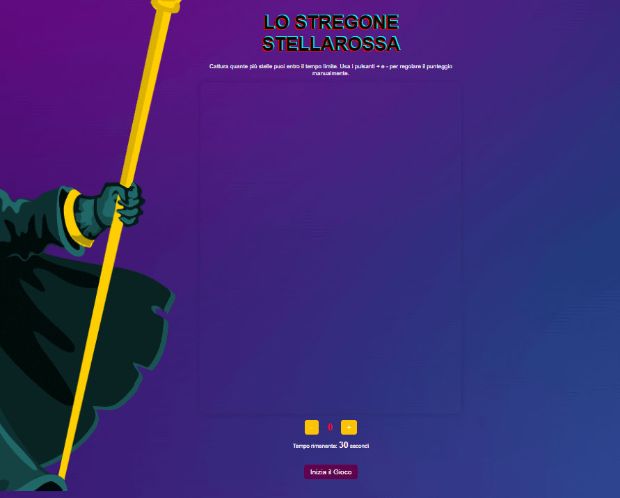
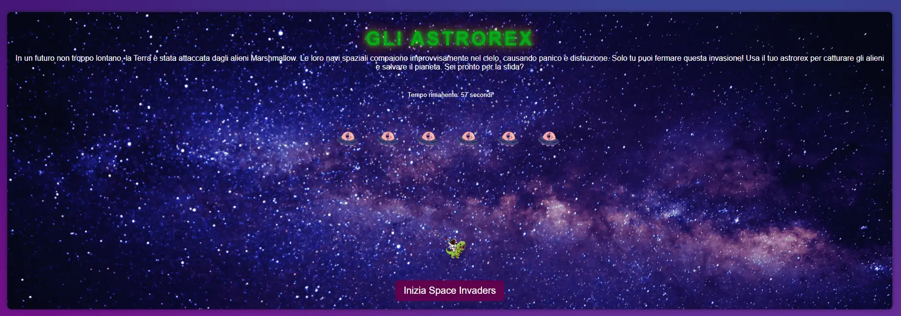

# Battaglie Stellari

Benvenuto nel progetto **Battaglie Stellari**! Questo è un sito web interattivo che presenta una serie di mini-giochi a tema spaziale, sviluppati per intrattenere e sfidare i giocatori. Ogni gioco ha un tema unico, con personaggi distinti e una storia avvincente.

## Descrizione del Progetto

Il sito web è composto da tre giochi principali:

1. **Lo Stregone Stellarossa**: Un gioco dove devi catturare quante più stelle possibile entro un tempo limite, per fermare lo stregone malvagio che ha oscurato il cielo.
   
2. **Gli Alieni Marshmallow**: Un gioco di battaglia spaziale dove devi difendere la galassia da un'invasione aliena.

3. **Gli Astrorex**: Un'avventura dove cavalchi un T-Rex nello spazio per fermare l'invasione degli Alieni Marshmallow e salvare il pianeta.

### Caratteristiche Principali
- **Storia Avvincente**: Ogni gioco è basato su una trama unica e coinvolgente.
- **Personaggi Unici**: Ogni gioco presenta personaggi distinti con background e motivazioni uniche.
- **Responsive Design**: Il sito è ottimizzato per essere visualizzato su dispositivi desktop, tablet e smartphone.
- **Integrazione Social**: é possibile condividere il gioco e collegarsi con me tramite i canali social integrati.

### Gioco 1: Lo stregone StellaRossa-Cattura le Stelle

**Scopo**: Cattura le stelle che appaiono nel gioco.

### Gioco 2: Il Gioco degli Alieni Marshmallow 

**Scopo**: Cattura tutti gli alieni che appaiono nel gioco.

### Gioco 3: Space Invaders- Gli Astrorex

**Scopo**: Difendi la Terra dagli alieni sparando ai nemici.

## Tecnologie Utilizzate

- **HTML**: Struttura della pagina web.
- **CSS**: Stili e layout per la pagina web.
- **JavaScript**: Logica dei giochi e interattività.

## Funzionalità

### Gioco 1: Cattura le Stelle

- **Scopo**: Cattura le stelle che appaiono nel gioco.
- **Controlli**: Pulsanti per incrementare e decrementare il punteggio manualmente.
- **Timer**: Il tempo per completare il gioco è di 30 secondi.

### Gioco 2: Il Gioco degli Alieni

- **Scopo**: Cattura tutti gli alieni che appaiono nel gioco.
- **Timer**: Il tempo per completare il gioco è di 30 secondi.
- **Pulsante**: Inizia il gioco e cattura gli alieni.

### Gioco 3: Space Invaders

- **Scopo**: Difendi la Terra dagli alieni sparando ai nemici.
- **Controlli**: Usa le frecce per muovere il giocatore e la barra spaziatrice per sparare.
- **Timer**: Il tempo per completare il gioco è di 60 secondi.

## Prova l'Applicazione

Puoi provare l'applicazione cliccando sul link seguente:

[Prova l'Applicazione Qui](https://battagliestellari.netlify.app/)
